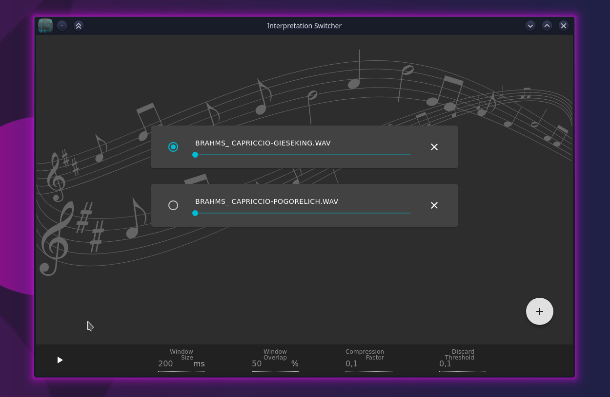

# Interpretation Switcher

An application that allows switching between multiple interpretations of a song during its reproduction without breaking the musical continuity. The application interface is built using [React](https://reactjs.org) with the [Electron](https://electronjs.org) framework to call the native code that evaluates the alignment between two audio tracks. The native code is written in C++ with the [Eigen](http://eigen.tuxfamily.org/index.php) library. The alignment algorithm implementation that powers the application can be compiled as a standalone library to be used as a C function in other applications. A more didactic implementation of the algorithm written in Julia is also available for testing and research.

## Building

### Application

You will need both npm and node-gyp installed on your machine and the eigen3 directory included in the compiling options (by default it will look in /usr/include/eigen3/). To build the application run the following commands in the cloned directory:

```bash
npm install
npm run package
```

The packaging process will create an out directory containing the result. To launch the application in development mode run:

```bash
npm start
```

instead of package after installing the dependencies.

### Library

To build the library as a standalone shared object just make sure that the eigen3 directory is included in your compiler options (will also look in /usr/include/eigen3/ by default) and run make inside the lib directory with:

```bash
cd lib
make libsndalign.so
```

## Alignment algorithm

The alignment algorithm consists in evaluating the DTW between two time-frequency chroma features representation extracted from the input audio signals. A more in-depth description of all the steps can be found in [here](docs/algorithm.md).



